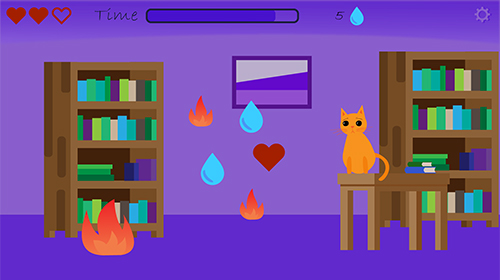

Interactive game with CSS animations, JavaScript functions, and conditional if statements.

Sprites come falling down from the top, so the "Falling" animation placed on a sprite's container. When clicking on a sprite, the sprite disappears, and it's another animation placed on the sprite.
Firedrops and the background fire move at all times of the game. Animations added and removed with CSS classes.

All the illustrations and sprite sounds I made myself in Adobe Illustrator and Adobe Audition respectively.
